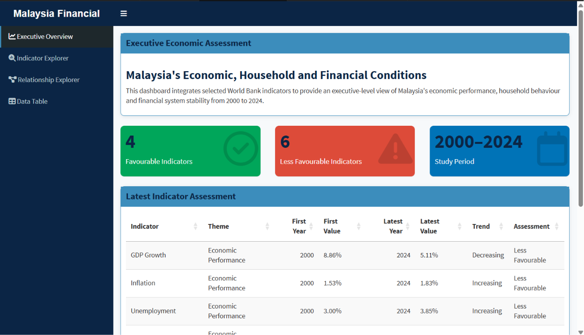
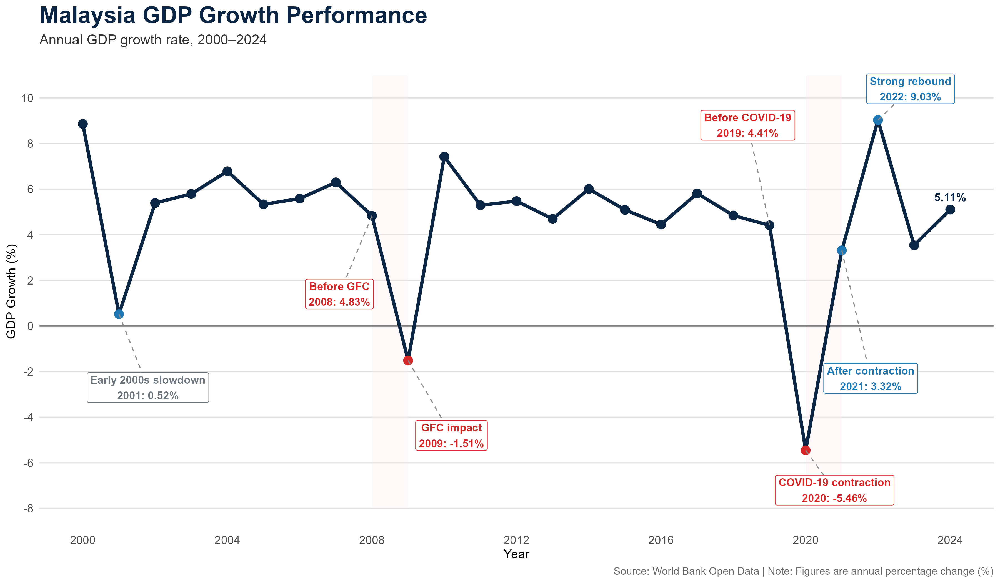
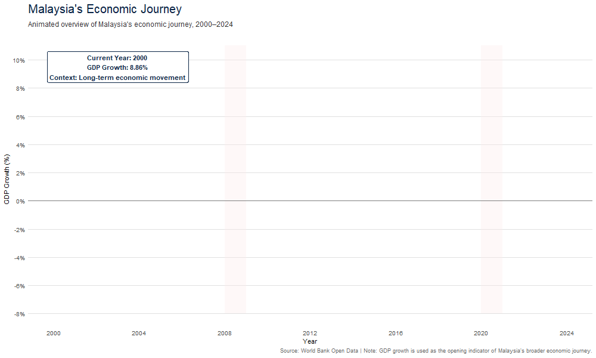
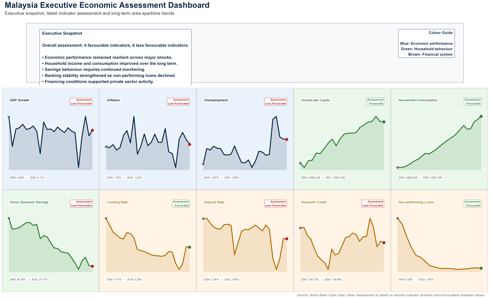

# 🇲🇾 Malaysia Financial Analytics Platform

A complete data engineering and visual analytics project that analyses Malaysia's economic and financial indicators using **Apache Hive**, **Python**, and **R**.

---

## Project Overview

This project demonstrates an end-to-end data analytics workflow beginning with raw World Bank data and ending with interactive visualisations and dashboards.

Unlike the prototype implementation, the final project uses **Apache Hive as the primary Extract, Transform and Load (ETL) platform**, while Python is retained as a validation workflow and R is used for visual analytics.

The project analyses ten key Malaysian economic and financial indicators covering the period from **2000 to 2024**.

---

## Project Objectives

- Build a complete ETL workflow using Apache Hive.
- Prepare analytical datasets for visualisation.
- Analyse long-term economic and financial trends.
- Develop static, animated and interactive visualisations in R.
- Demonstrate a reproducible data engineering pipeline.

---

## Technology Stack

| Component | Purpose |
|---|---|
| **Hadoop HDFS** | Stores the raw World Bank dataset in the HDP Sandbox |
| **Apache Hive** | Primary ETL engine for cleaning, transformation and analytical dataset preparation |
| **ORC** | Stores intermediate and analytical Hive tables efficiently |
| **Python / Jupyter Notebook** | Secondary validation and alternative data preparation workflow |
| **R / ggplot2** | Produces static analytical visualisations |
| **R / gganimate** | Produces animated economic trend visualisations |
| **R / Plotly** | Supports interactive visual analysis |
| **R Shiny** | Provides the analytical dashboard |
| **Git and GitHub** | Version control, documentation and project sharing |

---

## Final Project Architecture

```text
World Bank Open Data
          │
          ▼
Raw CSV File
          │
          ▼
Hadoop HDFS
          │
          ▼
Apache Hive
Primary ETL and Data Engineering
          │
          ├── Raw data registration
          ├── Staging and standardisation
          ├── Indicator catalogue
          ├── Indicator selection
          ├── Wide-to-long transformation
          ├── Dashboard dataset
          ├── Heatmap dataset
          ├── KPI summary
          └── Metadata summaries
          │
          ▼
Analytical CSV Files
          │
          ├───────────────┐
          ▼               ▼
Python Validation     R Visual Analytics
                           │
                           ▼
                 Storyboard and Dashboard

---

# Project Structure

The project is organised into separate components for data engineering, validation, visual analytics and outputs.

```text
malaysia-financial-analytics-platform/
│
├── data/
│   ├── raw/
│   │   └── worldbank_malaysia_raw.csv
│   │
│   ├── final/
│   │   ├── analysis_dataset_dashboard.csv
│   │   ├── analysis_dataset_full.csv
│   │   ├── analysis_dataset_heatmap.csv
│   │   └── executive_kpi_summary.csv
│   │
│   └── metadata/
│       ├── indicator_catalog.csv
│       ├── indicator_summary.csv
│       ├── project_metadata.csv
│       └── theme_summary.csv
│
├── hive/
│   └── 01_hive_data_management_pipeline.sql
│
├── notebooks/
│   ├── 01_data_management_pipeline.ipynb
│   └── config.py
│
├── r_visual_analytics/
│   ├── 02_visual_analytics_storyboard.R
│   └── app.R
│
├── visuals/
│   ├── animation/
│   └── storyboard/
│
├── .gitignore
├── README.md
└── requirements.txt
```

---

# Apache Hive Data Engineering Pipeline

The Hive SQL pipeline is located in

```text
hive/01_hive_data_management_pipeline.sql
```

The pipeline transforms the raw World Bank dataset into analytical datasets used by the R visual analytics layer.

| Stage | Hive Table | Purpose |
|------|----------------------------|---------------------------------------------|
| 1 | worldbank_raw | Registers the original World Bank CSV stored in HDFS |
| 2 | worldbank_stage | Cleans, standardises and filters the source dataset |
| 3 | indicator_catalog | Stores the ten selected indicators and metadata |
| 4 | selected_indicators | Extracts only the indicators required for analysis |
| 5 | analysis_dataset_full | Converts the source data from wide format into long format |
| 6 | analysis_dataset_dashboard | Produces the main dataset used by the R storyboard |
| 7 | analysis_dataset_heatmap | Produces a wide dataset for correlation analysis |
| 8 | executive_kpi_summary | Calculates descriptive statistics and trend indicators |
| 9 | indicator_summary | Summarises data availability for each indicator |
| 10 | theme_summary | Summarises observations by analytical theme |
| 11 | project_metadata | Stores project-level metadata |

---

## Hive Pipeline Validation

The completed Hive pipeline produced the following validated tables.

| Hive Table | Records |
|------------|--------:|
| worldbank_stage | 1,486 |
| indicator_catalog | 10 |
| selected_indicators | 10 |
| analysis_dataset_full | 241 |
| analysis_dataset_dashboard | 241 |
| analysis_dataset_heatmap | 25 |
| executive_kpi_summary | 10 |
| indicator_summary | 10 |
| theme_summary | 3 |
| project_metadata | 10 |

These results confirm that Apache Hive successfully completed the full ETL workflow and generated all analytical datasets required by the R visualisation layer.

---

## Why Apache Hive?

Apache Hive was selected as the primary ETL platform because it enables structured SQL-based processing on Hadoop while supporting scalable data preparation workflows.

Compared with the prototype Python implementation, the Hive workflow offers:

- Centralised data transformation within the Hadoop ecosystem.
- Reproducible SQL-based ETL processes.
- Clear separation between data engineering and visual analytics.
- Improved maintainability through modular pipeline stages.
- Direct integration with HDFS for large-scale data storage.

Python is retained only as a validation and reference implementation.

---

# Python Validation Workflow

The notebook

```text
notebooks/01_data_management_pipeline.ipynb
```

contains the earlier Python-based data preparation workflow.

Python is no longer the primary ETL platform in the final architecture. It is retained to provide:

- an alternative implementation outside Hadoop;
- validation of the Hive outputs;
- comparison between Python and Hive transformations;
- easier inspection of intermediate datasets;
- additional reproducibility for users without access to the HDP Sandbox.

The Python notebook performs similar tasks to the Hive pipeline:

1. Loads the cleaned World Bank CSV.
2. Selects the ten required indicators.
3. Converts the data from wide format to long format.
4. Creates dashboard and heatmap datasets.
5. Generates KPI and metadata summaries.
6. Exports the final CSV files.

The final project therefore contains two data preparation implementations:

| Implementation | Role |
|---|---|
| Apache Hive | Primary ETL and data engineering workflow |
| Python | Secondary validation and alternative implementation |

The existence of both workflows allows the output structure and record counts to be compared independently.

---

# R Visual Analytics

The main visual analytics script is located at:

```text
r_visual_analytics/02_visual_analytics_storyboard.R
```

R reads the analytical CSV files from:

```text
data/final/
data/metadata/
```

The script uses the following main packages:

| Package | Purpose |
|---|---|
| `tidyverse` | Data manipulation and reshaping |
| `ggplot2` | Static analytical visualisations |
| `gganimate` | Animated GDP growth visualisation |
| `plotly` | Interactive chart development |
| `patchwork` | Combining multiple charts into panels |
| `broom` | Extracting regression statistics |
| `scales` | Axis and label formatting |
| `htmlwidgets` | Saving interactive visualisations |

The visual analytics workflow focuses on ten indicators:

### Economic Well-being

- GDP Growth
- Inflation
- Unemployment
- Income per Capita

### Household Financial Behaviour

- Household Consumption
- Gross Domestic Savings

### Financial System Support

- Lending Rate
- Deposit Rate
- Domestic Credit
- Non-performing Loans

---

## Visual Analytics Workflow

```text
Hive Analytical Tables
          │
          ▼
Exported CSV Files
          │
          ▼
R Data Validation
          │
          ├── Check missing values
          ├── Check duplicate records
          ├── Confirm indicator coverage
          └── Confirm year ranges
          │
          ▼
R Visual Analysis
          │
          ├── Time-series analysis
          ├── Event-based annotations
          ├── Correlation analysis
          ├── Regression analysis
          ├── KPI assessment
          └── Animated visualisation
          │
          ▼
Storyboard and Dashboard Outputs
```

---

# R Shiny Dashboard

The Shiny dashboard is stored in:

```text
r_visual_analytics/app.R
```

The dashboard provides an interactive environment for exploring Malaysia's economic and financial indicators.

Its role is different from the storyboard:

| Component | Purpose |
|---|---|
| Visual analytics storyboard | Presents a guided analytical narrative |
| R Shiny dashboard | Allows users to explore indicators interactively |

To run the dashboard from the project root:

```r
shiny::runApp("r_visual_analytics")
```

The dashboard uses the prepared analytical datasets and does not perform the primary ETL work.

---

# Separation of Responsibilities

The final project architecture follows a clear separation of responsibilities.

| Platform | Main Responsibility |
|---|---|
| Hadoop HDFS | Raw data storage |
| Apache Hive | Cleaning, transformation, aggregation and export preparation |
| Python | Validation and alternative ETL implementation |
| R | Visual analysis, statistical interpretation and dashboard development |
| GitHub | Documentation, version control and project sharing |

This separation improves clarity, reproducibility and maintainability.

---

---

---

# Project Outputs

The Malaysia Financial Analytics Platform produces a comprehensive collection of static, animated and interactive visualisations developed using **R**, **ggplot2**, **gganimate**, **Plotly** and **R Shiny**. These visual outputs are generated directly from the analytical datasets prepared through the Apache Hive ETL pipeline and provide different perspectives of Malaysia's economic and financial performance between **2000 and 2024**.

The figures below present representative outputs from the project. The complete collection of visualisations is available in the `visuals/` directory.

---

## 1. Interactive Executive Dashboard



The Interactive Executive Dashboard serves as the primary interface of the Malaysia Financial Analytics Platform. Developed using **R Shiny**, it enables users to explore Malaysia's economic, household and financial indicators through an intuitive web application.

The dashboard integrates executive summaries, indicator exploration, relationship analysis and data tables into a single platform, allowing users to interactively examine the analytical results without modifying the underlying datasets.

---

## 2. Malaysia GDP Growth Performance (2000–2024)



This visualisation presents Malaysia's annual GDP growth over the study period and highlights significant economic events such as the Global Financial Crisis (2008–2009) and the COVID-19 pandemic (2020). The figure provides an overview of Malaysia's long-term economic resilience and recovery.

---

## 3. Malaysia Economic Journey (Animated)



The animated visualisation demonstrates the evolution of Malaysia's GDP growth from 2000 to 2024 using **gganimate**. By presenting economic performance dynamically over time, the animation enhances temporal interpretation beyond conventional static charts.

---

## 4. Executive Economic Assessment Dashboard



The Executive Economic Assessment summarises the overall performance of the ten selected World Bank indicators within a single dashboard. It combines multiple analytical outputs to provide an executive-level overview of Malaysia's economic performance, household financial behaviour and financial system stability throughout the study period.

---

## Additional Visual Outputs

Besides the representative figures shown above, the project also produces a comprehensive collection of visual analytics, including:

- Malaysia Inflation Performance
- Malaysia Unemployment Performance
- Household Income Growth
- Household Financial Behaviour
- Borrowing and Saving Environment
- Domestic Credit Performance
- Banking Stability Assessment
- Correlation Analysis
- Heatmaps
- Interactive Plotly Visualisations
- Executive Dashboard Components

The complete visual outputs are organised within the following directories:

```text
visuals/
├── animation/
├── correlations/
├── dashboard/
├── heatmaps/
├── interactive/
├── storyboard/
└── trends/
```

These visualisations collectively support the interpretation of Malaysia's economic and financial conditions while demonstrating the integration of Apache Hive, Python and R within a complete data analytics workflow.

---

# Repository Guide

The table below provides a quick reference to the main project components.

| If you want to... | Open |
|-------------------|------|
| Understand the project | `README.md` |
| Review the Apache Hive ETL pipeline | `hive/01_hive_data_management_pipeline.sql` |
| Review the Python validation workflow | `notebooks/01_data_management_pipeline.ipynb` |
| Review the R visual analytics workflow | `r_visual_analytics/02_visual_analytics_storyboard.R` |
| Run the interactive dashboard | `r_visual_analytics/app.R` |
| View generated visual outputs | `visuals/storyboard/` |
| View the animated visualisation | `visuals/animation/` |
| Review exported analytical datasets | `data/final/` |
| Review metadata tables | `data/metadata/` |

---

# Quick Start

There are two ways to use this repository.

## Option 1 – Reproduce the Complete Project

Follow these steps to execute the full workflow.

### Step 1 – Clone the Repository

```bash
git clone <repository-url>
cd malaysia-financial-analytics-platform
```

---

### Step 2 – Start the HDP Sandbox

Start the HDP Sandbox Virtual Machine and ensure the following services are available:

- HDFS
- Hive
- YARN
- MapReduce2

---

### Step 3 – Upload the Source Dataset

Upload

```text
worldbank_malaysia_raw.csv
```

into

```text
/user/maria_dev/malaysia_finance/raw/
```

inside HDFS.

---

### Step 4 – Execute the Hive Pipeline

Run

```text
hive/01_hive_data_management_pipeline.sql
```

using Ambari Hive View or the Hive command-line interface.

The script creates all analytical datasets required by the R visual analytics workflow.

---

### Step 5 – Export the Hive Outputs

Export the generated Hive tables as CSV files into

```text
data/final/
data/metadata/
```

---

### Step 6 – Run the Storyboard

Open RStudio and execute

```r
source("r_visual_analytics/02_visual_analytics_storyboard.R")
```

---

### Step 7 – Run the Dashboard

```r
shiny::runApp("r_visual_analytics")
```

---

## Option 2 – Explore the Finished Project

If you simply want to review the completed work:

1. Read this README.
2. Browse the visual outputs in `visuals/storyboard/`.
3. Watch the animated visualisation in `visuals/animation/`.
4. Review the Hive ETL pipeline.
5. Review the Python validation notebook.
6. Explore the R visual analytics scripts.

No Hadoop installation is required for this option.

---

# Expected Outputs

After executing the complete workflow, the following datasets should be available.

| Dataset | Expected Records |
|---------|-----------------:|
| analysis_dataset_dashboard | 241 |
| analysis_dataset_heatmap | 25 |
| executive_kpi_summary | 10 |
| indicator_catalog | 10 |
| indicator_summary | 10 |
| theme_summary | 3 |
| project_metadata | 10 |

These datasets are then consumed directly by the R visual analytics layer.

---

# Project Documentation

Supporting presentation materials are available in the `documentation/` folder.

| Document | Purpose |
|---|---|
| [Presentation Slides — PowerPoint](documentation/Malaysia_Financial_Analytics_Platform_Slides.pptx) | Editable presentation covering the project analysis and visual findings. |
| [Presentation Slides — PDF](documentation/Malaysia_Financial_Analytics_Platform_Slides.pdf) | Portable version for viewing and submission. |

The slides provide the detailed analytical narrative, while this README focuses on the technical architecture, workflow and reproducibility of the project.

---

# Future Improvements

Several enhancements could be implemented in future versions of the project:

- Replace manual CSV loading with direct data retrieval from the World Bank API.
- Automate the Hive ETL workflow using Apache Oozie or Apache Airflow.
- Extend the analytical dataset with additional economic and financial indicators.
- Deploy the R Shiny dashboard on a cloud platform for wider accessibility.
- Introduce automated data quality validation before executing the ETL pipeline.
- Explore Spark SQL as an alternative distributed processing engine for larger datasets.

These enhancements would improve automation, scalability and long-term maintainability.

---

# Author

**Hasma Nizam Mohamad Hassan**

Master of Science (Data Science and Analytics)

Universiti Kebangsaan Malaysia

This project was developed as part of an academic data engineering and visual analytics portfolio, demonstrating the integration of Apache Hive, Python and R within a complete analytics workflow.

